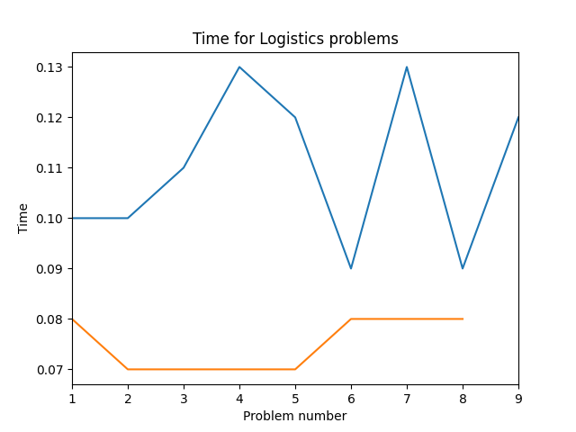

## Projet Sat4j et Pddl4j

Création d'un planner avec la bibliothèque Sat4j. Afin de la comparer les performances avec la bibliothèque pddl4j

Nous avons réalisé 3 test sur les domaines suivant : Blocks, gripper et logistics
Un script.sh permet d'executer les commandes afin dextraire le temps dexectution de chaque planner.

Avec un script jupyter lab nous comparons les temps entre les deux planners pour les 3 problemes.

## Projet Planner MonteCarlo

Création d'un planner de type MONTECARLO pour comparer les performances avec la bibliothèque pddl4j.

Nous avons testé les planner ASP et SIMON (montecarlo) sur mêmes 3 domaines.

### Tests sur Blocks

  
  

<!-- SatPlanner/data_stats/data_stats/ chemin d'accès dossier-->

Pour ce domaine les temps d'execution de SIMON a partir des problèmes 9 etaient trop grand (9: 50.54s, 10: 150.41s, 11: 18.41s, 12: 8.64s) par rapport au premiers problemes (< 1s) ce qui empechait la visualisation des résultats. Nous avons donc choisi de ne pas le représenter sur les graphiques.

### Tests sur Logistics

  
  

Même problème pour ce domaine avec le temps d'execution de SIMON pour le dernier probleme (9: 39,65s) etait beaucoup trop grand par rapport aux autres (< 0.25s). 

### Tests sur Gripper

  
  

Les résultats sur Gripper sont anormaux ASP
NORMAL QUE ASP soit a 30sec sur le 2 ???? possible de refaire ???

En regardant ces graphiques on remarque que, dans l'ensemble, ASP est meilleure que SIMON aussi bien sur le temps total que sur le nombre d'action total.

Ces résultats sont normales etant donné la nature de chacun des ces planners. En effet, ASP effectue une recherche rapide et trouvera sistématiquement la solution optimale tandis que l'algorithme de Montecarlo fait effectue une recherche aléatoire et son temps d'execution depend fortement de ce paramètre aléatoire et cela se repercute aussi sur la taille du plan solution.

Ses performances peuvent donc être très variables et peuvent se rapprocher de ASP (voir les égaler avec un peu de chance) ou alors atteindre des valeures abérrantes. Comme pour le domaine Logistics par exemple, avec les problèmes 9, 10, 11 et 12 sur lesquels SIMON a un temps d'execution plus de 100 fois supérieur à ASP.

Au final on voit que l'algorithme de monte carlo n'est pas un algorithme de recherche performant cependant il a d'autres avantages notamment sa consomation de ressource. En effet, c'est un algorithme très peu couteux tant en mémoire que en calculs et cela en fait un très bon algorithme pour rechercher rapidement l'existence ou non d'un plan solution par exemple.

